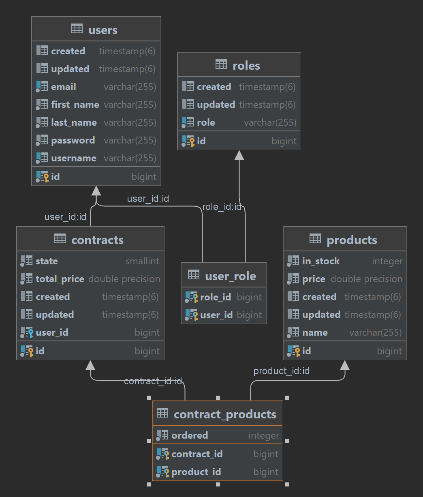

Demo aplikace pro předmět Programování internetových aplikací.

Beckend je jednoduchá Spring boot aplikace se několika REST endpointy a JWT zabezpečením. Pro rychlou orientaci je k dispozici Swagger.
Pro spuštění je potřeba doplnit konfigurační soubor.

Databázové schéma Beckend aplikace:

Frontend skrze React knihovnu poskytuje demonstarční napojení na beckend. Obsahuje ukázku přihlášení a fetchování dat skrze ednpointy.